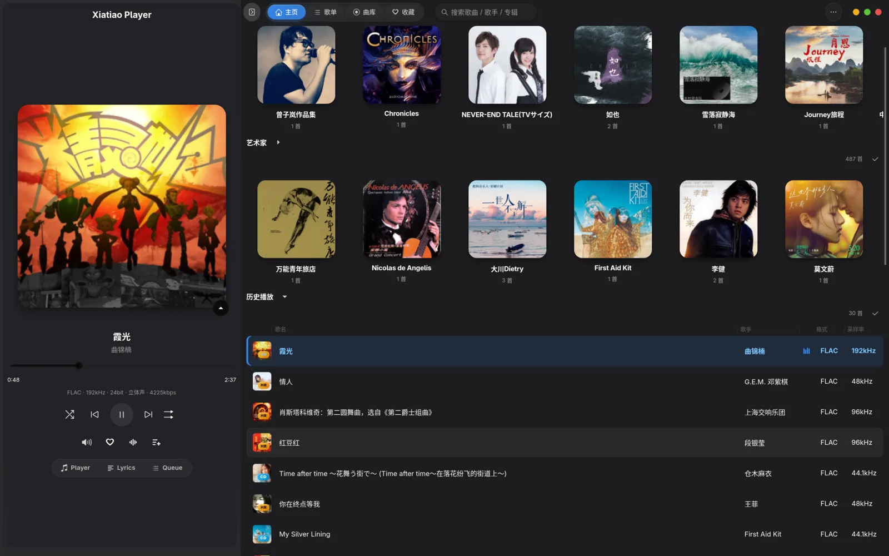
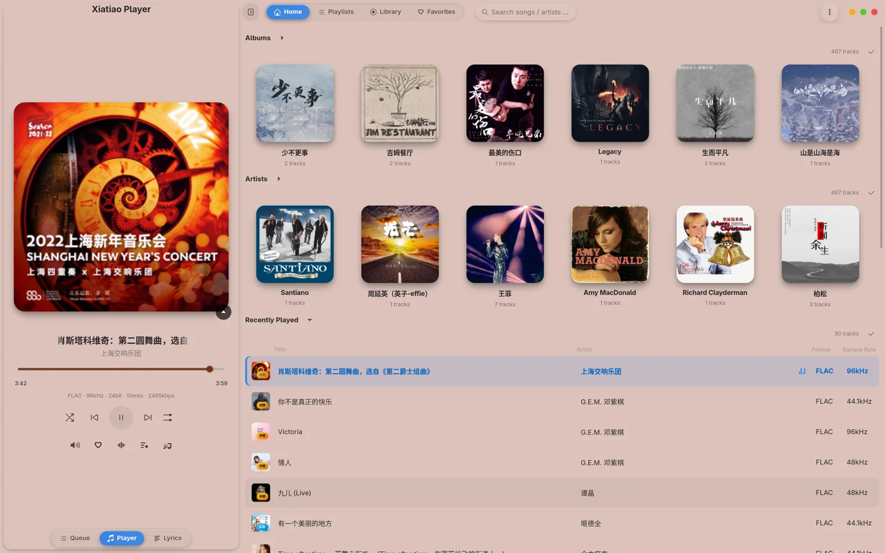
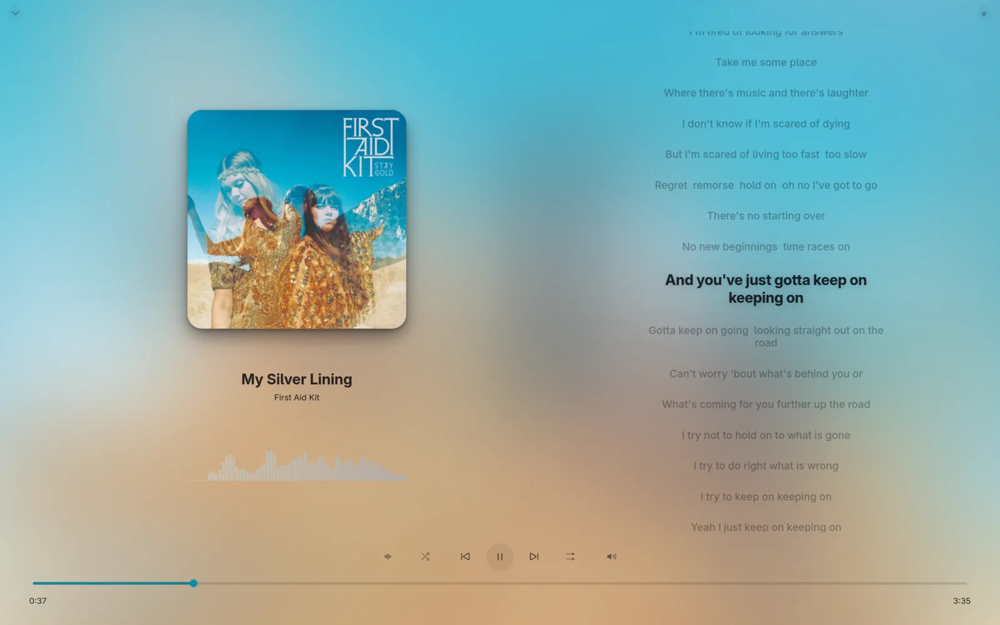
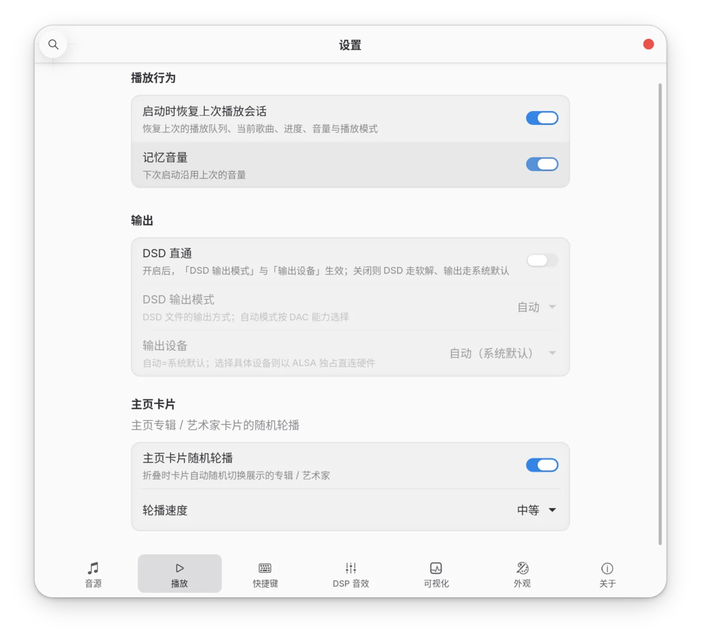
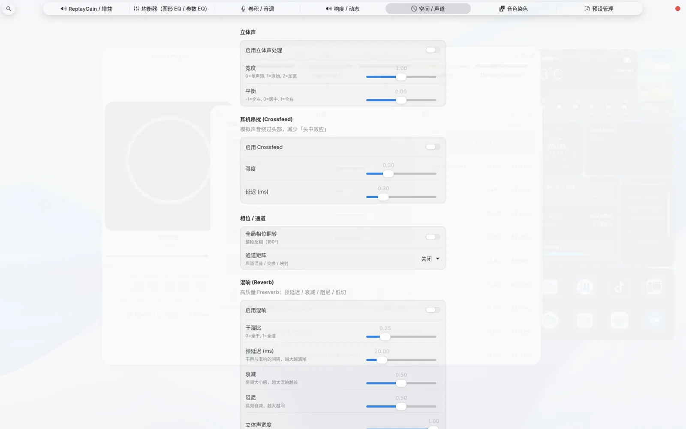

# 虾条播放器 Xiatiao Player

  

  一个注重音质的 GTK4 本地音乐播放器，音频后端用 Rust 编写。
   
  名字谐音「瞎调」与「虾条」。

  
  
  
  

---

## 📸 界面预览

  
  
   
  <em>主页 · 暗色 / 浅色</em>

  
   
  <em>主界面背景跟随封面主色调</em>

  
   
  <em>沉浸式播放页（封面 + 歌词 + 频谱）</em>

  
  
   
  <em>设置 · 高级 DSP</em>

---

## ✨ 功能特性

### 音质优先

- **保持源采样率，不重采样** —— DSP 关闭时为 bit-perfect 直通
- **采样率跟随** —— 原生 PipeWire 输出，DAC 跟随源文件采样率
- **DSD 支持** —— 原生直通（Native DSD_U32）/ DoP 封装 / PCM 软解三种模式
- **ALSA 独占输出** —— 可选绕过音频服务，直连 hw: 设备

### 音效与 DSP

- 内嵌 **CamillaDSP** 引擎，参数实时平滑更新（无爆音）
- 丰富效果链：10 段图形 EQ、PEQ、低音/高音、动态等响度（ISO 226）、压缩器、限幅器、立体声宽度、声道平衡、Crossfeed、卷积混响、电子管染色、BBE
- 卷积 IR 自动按播放采样率重采样

### 播放与管理

- 本地曲库扫描：mp3 / flac / ape / wv / m4a / ogg / wav / dsf / dff
- 解码：symphonia（原生）+ ffmpeg（高压缩格式与 DSD）
- 播放列表、歌单、收藏（我喜欢）、播放历史
- 沉浸式全屏页、滚动歌词、频谱可视化
- **主界面背景跟随封面** —— 可选让整个界面用当前封面主色调着色
- **MPRIS2** 媒体控制、系统托盘

---

## 🏗️ 架构

前端 Python + PyGObject（GTK4 / libadwaita），后端 Rust 独立进程，通过 Unix domain socket + JSON Lines 通信。

    ┌─────────────────────────┐        ┌──────────────────────────┐
    │   Python (GTK4 UI)      │        │   Rust 音频后端           │
    │   main.py / ui/         │◀──IPC─▶│   audio_backend_rs/      │
    │   core/ models/ ...     │  Unix  │   decode / dsp / output  │
    │  · 界面与交互            │ socket │  · 解码（symphonia+ffmpeg）│
    │  · 曲库/歌单/收藏管理    │ + JSON │  · DSP 链（含 CamillaDSP） │
    │  · MPRIS2 / 托盘        │  Lines │  · 输出（PipeWire / ALSA） │
    └─────────────────────────┘        └──────────────────────────┘

- **音频输出**：默认 PipeWire（原生接口，采样率跟随）；可选 ALSA 独占
- **DSP**：Rust 侧实现 + 内嵌 CamillaDSP（camillalib）

---

## 📦 安装

### 方式一：Debian 包（推荐）

从 Releases 下载 .deb 后：

    apt install ./xiatiao-player_1.0.2_amd64.deb

（需要管理员权限；安装后程序在 /usr/lib/xiatiao-player/，启动器 /usr/bin/xiatiao-player，也可在应用菜单中找到「虾条播放器」。）

### 方式二：从源码运行

系统依赖（Debian / Ubuntu）：

    apt install python3-gi python3-gi-cairo python3-numpy python3-yaml \
         python3-mutagen gir1.2-gtk-4.0 gir1.2-adw-1 gir1.2-gdkpixbuf-2.0 \
         gir1.2-gstreamer-1.0 gir1.2-gst-plugins-base-1.0 \
         ffmpeg pipewire pipewire-bin libasound2-dev

构建并运行：

    git clone https://github.com/usbipad/Xiatiao-Player.git
    cd Xiatiao-Player/audio_backend_rs && cargo build --release && cd ..
    python3 main.py

---

## 🔨 从源码打包 .deb

推荐用 **Debian 12 基线**构建。产物最高只需 GLIBC_2.34，一个包即可覆盖 Debian 12 / 13 / 14 与 Ubuntu 22.04 / 24.04 及以上：

    # 一次性：生成构建 chroot（含新版 Rust + libclang）
    bash tools/prepare_debian12_chroot.sh

    # 构建 .deb（产物输出到 release/）
    # TMPDIR 须为 world-executable 的大磁盘目录（用 /var/tmp）
    TMPDIR=/var/tmp bash tools/build_deb_debian12.sh

为何不在本机直接 dpkg-buildpackage：较新系统（如 Debian sid，glibc 2.43）编译出的二进制要求 GLIBC_2.43，无法在 Debian 12 / Ubuntu 22.04 运行。必须在目标最低版本环境里构建，glibc 需求才会降下来。

打包配置位于 debian/：control（元信息与依赖）、rules（编译 + 组装）、changelog（版本历史）、postinst（刷新图标/desktop 缓存）。

---

## 🧪 测试

    # Rust 单元测试（DSP / DSD / 输出 / Camilla 等）
    cd audio_backend_rs && cargo test --release

    # Python 冒烟测试
    python3 tests/smoke_test.py

---

## 🐛 调试

出问题时用一键调试入口开启全量诊断日志（无需改代码）：

    bash tools/debug_run.sh            # DEBUG 级别
    bash tools/debug_run.sh verbose    # 更啰嗦（含 GTK 噪音）

详见 docs/DEBUG.md。

---

## 📁 目录结构

    main.py              应用入口
    config/              配置与设置
    core/                核心逻辑（audio_backend / rust_backend / player_core / playlist / *_store / camilla）
    models/              数据模型（曲目/歌词/封面/ReplayGain）
    providers/           音源提供者
    services/            MPRIS2 / 系统托盘 / 快捷键 / 资源加载
    ui/                  GTK4 界面（window.py 主窗口）
    data/                运行时资源（图标 / desktop）
    audio_backend_rs/    Rust 音频后端
    debian/              Debian 打包配置
    docs/                文档与界面截图
    tests/               冒烟测试
    release/             发布产物（.deb，不入库）
    tools/               构建脚本（打包 / 图标生成 / 调试入口）

---

## 📄 许可证

**GPL-3.0**（因内嵌 CamillaDSP）。详见 [LICENSE](LICENSE)。

---

## 🙏 鸣谢

- [CamillaDSP](https://github.com/HEnquist/camilladsp) —— 内嵌 DSP 引擎
- [symphonia](https://github.com/pdeljanov/Symphonia) —— Rust 原生音频解码
- [FFmpeg](https://ffmpeg.org/) —— 高压缩格式与 DSD 解码
- [GTK](https://gtk.org/) / [libadwaita](https://gnome.pages.gitlab.gnome.org/libadwaita/) —— 界面框架
