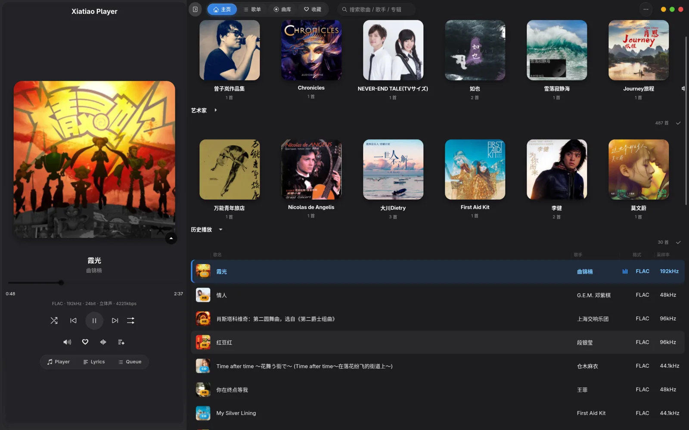
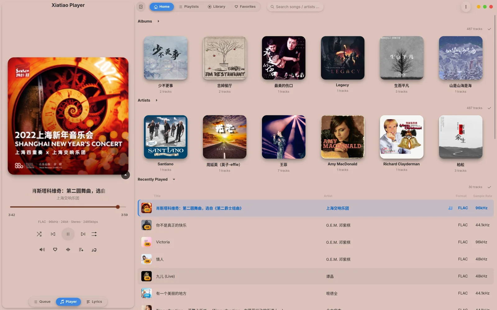
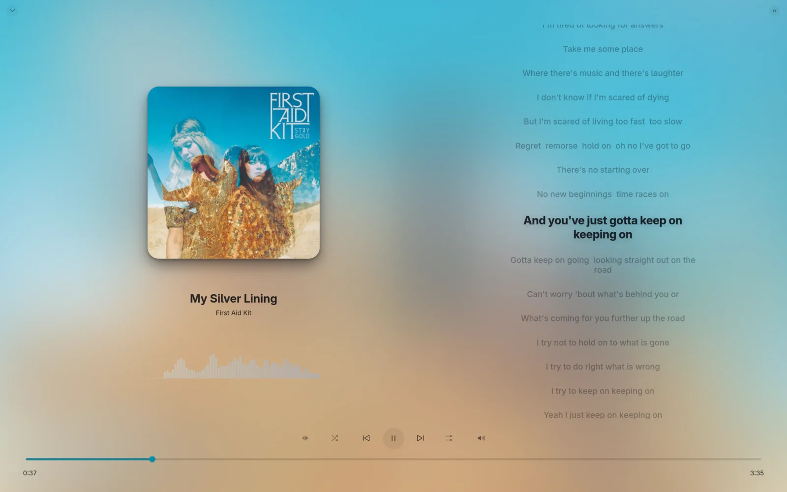
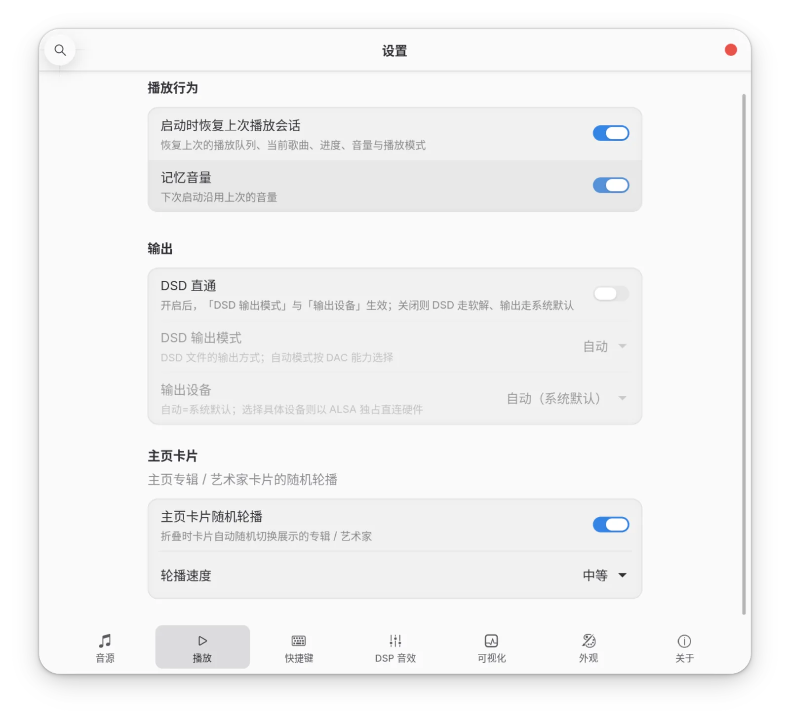
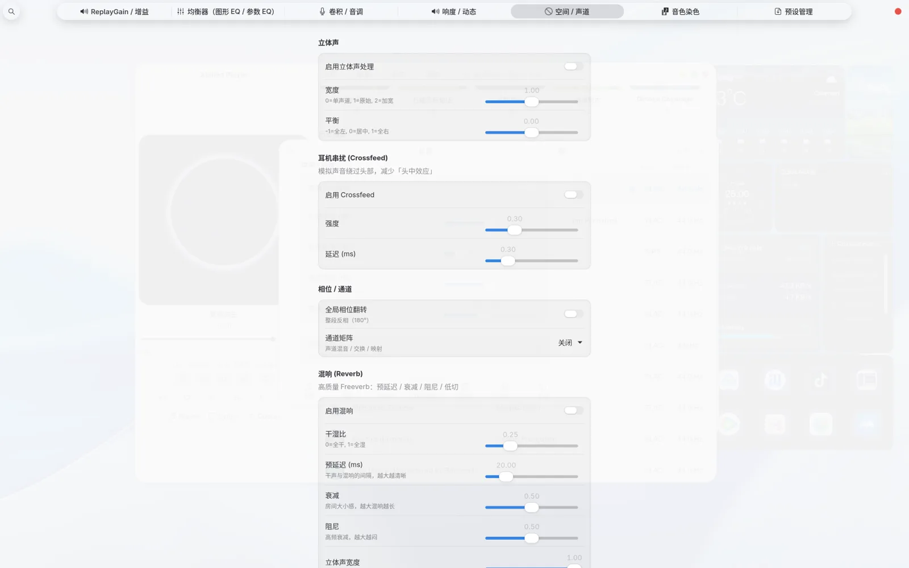

# 虾条播放器 · Xiatiao Player

**注重音质的 GTK4 音乐播放器** · 本地曲库 + Subsonic 在线音源 · Rust 音频后端

名字谐音「瞎调」与「虾条」

**语言 / Language：** [中文](#中文) · [English](#english)

---

## 📖 中文说明

## 📸 界面预览

| 主页 · 暗色 | 主页 · 浅色 |
| :---: | :---: |
|  |  |

| 背景跟随封面 | 沉浸式播放页 |
| :---: | :---: |
|  |  |

| 设置 | 高级 DSP |
| :---: | :---: |
|  |  |

### ✨ 功能

一款本地优先、也支持在线音源的现代播放器：

- **本地 + 在线**：播放本地曲库，或连接任意标准 Subsonic 服务端（如 Navidrome）在线收听
- **DLNA 投送**：发现局域网 DLNA 渲染器，把音乐推送到音响 / 电视播放
- **内嵌 DSP**：内置 CamillaDSP，支持 EQ、PEQ、响度、限幅等音效调整
- **沉浸式界面**：背景跟随封面着色、全屏播放页、频谱可视化
- **音质**：支持 mp3 / flac / ape / wv / m4a / dsd 等格式；DSP 处理不改变音频数据采样率
- MPRIS2 媒体控制，适配 Linux 桌面

### 📦 安装

#### 方式一：Debian 包（推荐）

从 Releases 下载 .deb 后：

    apt install ./xiatiao-player_1.0.5_amd64.deb

（需要管理员权限；安装后程序在 /usr/lib/xiatiao-player/，启动器 /usr/bin/xiatiao-player，也可在应用菜单中找到「虾条播放器」。）

#### 方式二：Fedora 包（RPM）

需先启用 **RPM Fusion**（依赖完整 ffmpeg 以支持 DSD 解码）：

    sudo dnf install https://mirrors.rpmfusion.org/free/fedora/rpmfusion-free-release-$(rpm -E %fedora).noarch.rpm
    sudo dnf install ./xiatiao-player-1.0.5-1.fc44.x86_64.rpm

#### 方式三：从源码运行

系统依赖（Debian / Ubuntu）：

    apt install python3-gi python3-gi-cairo python3-cairo python3-numpy \
         python3-yaml python3-mutagen gir1.2-gtk-4.0 gir1.2-adw-1 \
         gir1.2-gdkpixbuf-2.0 gir1.2-gstreamer-1.0 gir1.2-gst-plugins-base-1.0 \
         librsvg2-common webp-pixbuf-loader \
         ffmpeg pipewire pipewire-bin pulseaudio-utils \
         iproute2 libglib2.0-bin xdg-utils dbus-bin

构建并运行：

    git clone https://github.com/usbipad/Xiatiao-Player.git
    cd Xiatiao-Player/audio_backend_rs && cargo build --release && cd ..
    python3 main.py

### 📄 许可证

**GPL-3.0**（因内嵌 CamillaDSP）。详见 [LICENSE](LICENSE)。

### 🙏 鸣谢

- [CamillaDSP](https://github.com/HEnquist/camilladsp) —— 内嵌 DSP 引擎
- [symphonia](https://github.com/pdeljanov/Symphonia) —— Rust 原生音频解码
- [FFmpeg](https://ffmpeg.org/) —— 高压缩格式与 DSD 解码
- [GTK](https://gtk.org/) / [libadwaita](https://gnome.pages.gitlab.gnome.org/libadwaita/) —— 界面框架

---

## 📖 English

**Xiatiao Player** — a GTK4 music player focused on sound quality (local library + Subsonic online sources), with a Rust audio backend. The name is a pun on "瞎调" (messing around) and "虾条" (shrimp sticks).

### 📸 Screenshots

| Home · Dark | Home · Light |
| :---: | :---: |
|  |  |

| Background Follows Cover | Now Playing |
| :---: | :---: |
|  |  |

| Settings | Advanced DSP |
| :---: | :---: |
|  |  |

### ✨ Features

A modern player that is local-first yet also supports online sources:

- **Local + Online**: play your local library, or stream from any standard Subsonic server (e.g. Navidrome)
- **DLNA casting**: discover LAN DLNA renderers and push music to speakers / TVs
- **Embedded DSP**: built-in CamillaDSP with EQ, PEQ, loudness, limiter and more
- **Immersive UI**: background tinted by the cover, full-screen now-playing, spectrum visualization
- **Formats & quality**: supports mp3 / flac / ape / wv / m4a / dsd; DSP processing does not change the audio data's sample rate
- MPRIS2 media control, integrated with the Linux desktop

### 📦 Installation

#### Option 1: Debian package (recommended)

Download the `.deb` from Releases, then:

    sudo apt install ./xiatiao-player_1.0.5_amd64.deb

(Requires admin rights. Installed to /usr/lib/xiatiao-player/, launcher at /usr/bin/xiatiao-player, also available in the app menu as "Xiatiao Player".)

#### Option 2: Fedora package (RPM)

Requires **RPM Fusion** (for the full ffmpeg with DSD decoding):

    sudo dnf install https://mirrors.rpmfusion.org/free/fedora/rpmfusion-free-release-$(rpm -E %fedora).noarch.rpm
    sudo dnf install ./xiatiao-player-1.0.5-1.fc44.x86_64.rpm

#### Option 3: Run from source

System dependencies (Debian / Ubuntu):

    sudo apt install python3-gi python3-gi-cairo python3-cairo python3-numpy \
         python3-yaml python3-mutagen gir1.2-gtk-4.0 gir1.2-adw-1 \
         gir1.2-gdkpixbuf-2.0 gir1.2-gstreamer-1.0 gir1.2-gst-plugins-base-1.0 \
         librsvg2-common webp-pixbuf-loader \
         ffmpeg pipewire pipewire-bin pulseaudio-utils \
         iproute2 libglib2.0-bin xdg-utils dbus-bin

Build and run:

    git clone https://github.com/usbipad/Xiatiao-Player.git
    cd Xiatiao-Player/audio_backend_rs && cargo build --release && cd ..
    python3 main.py

### 📄 License

**GPL-3.0** (due to embedded CamillaDSP). See [LICENSE](LICENSE).

### 🙏 Credits

- [CamillaDSP](https://github.com/HEnquist/camilladsp) — embedded DSP engine
- [symphonia](https://github.com/pdeljanov/Symphonia) — native Rust audio decoding
- [FFmpeg](https://ffmpeg.org/) — high-compression formats and DSD decoding
- [GTK](https://gtk.org/) / [libadwaita](https://gnome.pages.gitlab.gnome.org/libadwaita/) — UI framework
